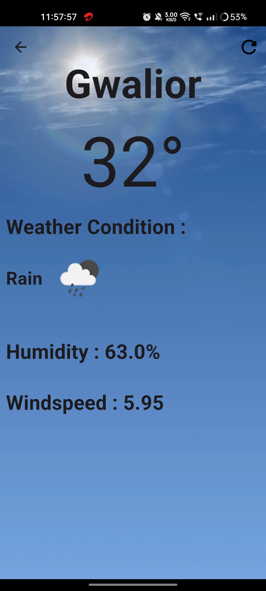
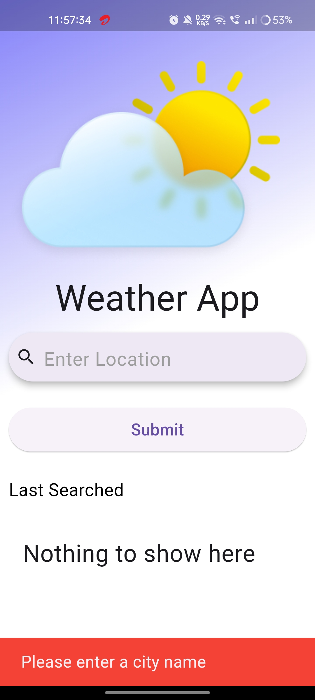
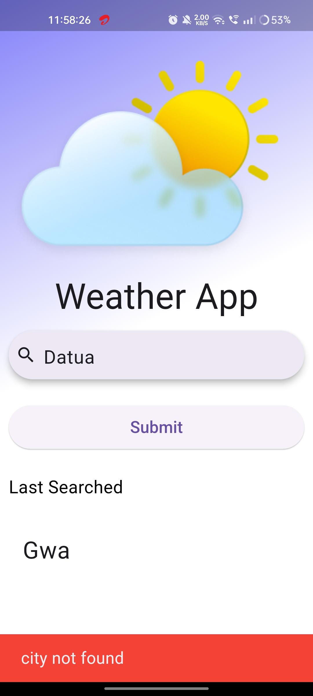
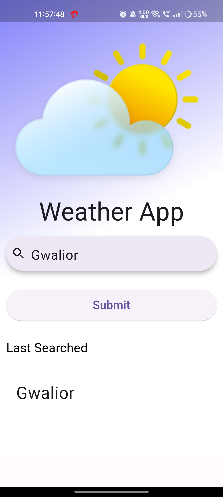

# Weather App

## Setup Instructions

Follow these steps to set up the Weather app locally on your device:

1. **Clone the Repository:** Clone the  repository from [https://github.com/yash9111/Weather-App.git](#) to your local machine.

2. **Setup APi key:** Navigate to `lib/core/constants/api_constants.dart` change the value of `API_KEY` variable to your OpenWeatherAPi api key . 

3. **Run the app:**
   - Run `flutter run` to start the Flutter  application.

## Screenshots 
### Home Screen 

### Weather Details

### Error Handling

### History Management

